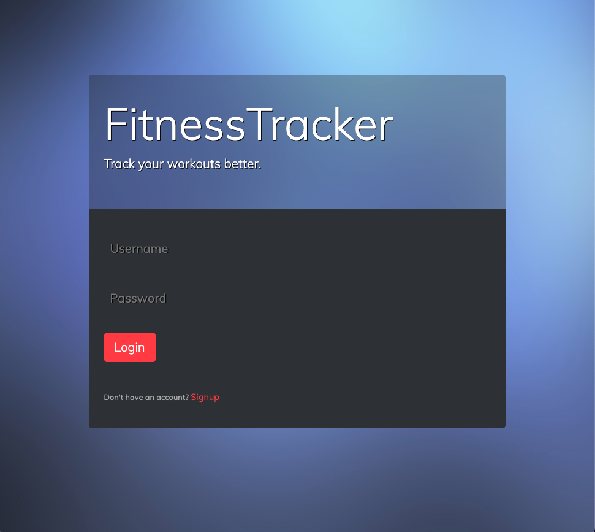
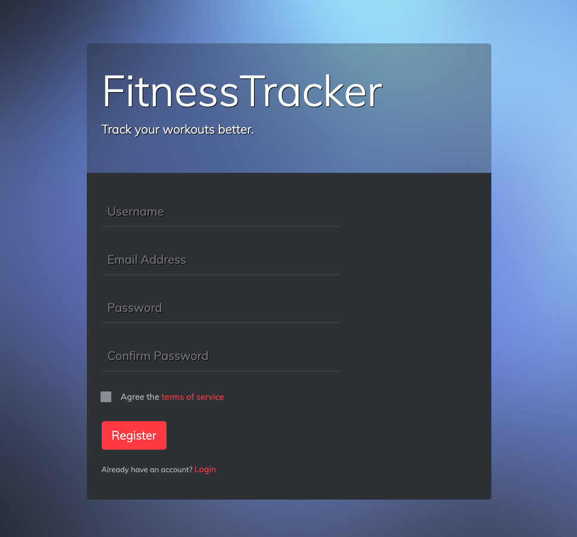
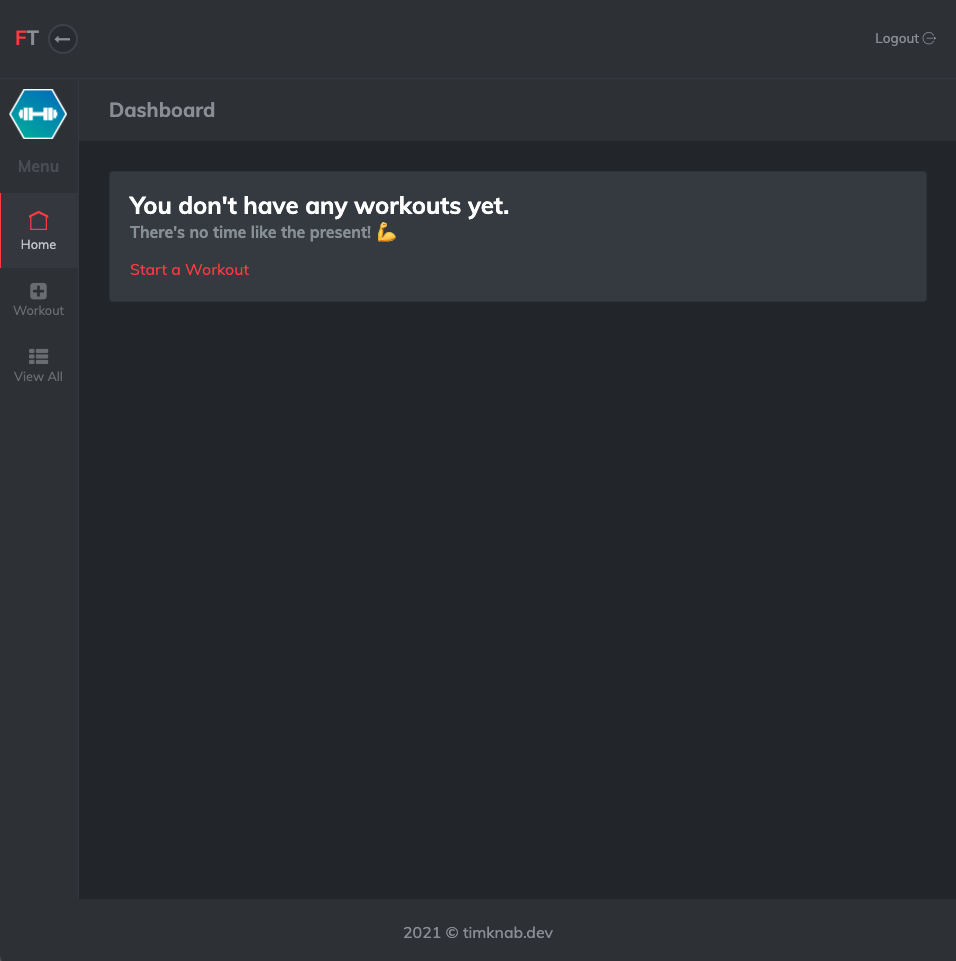
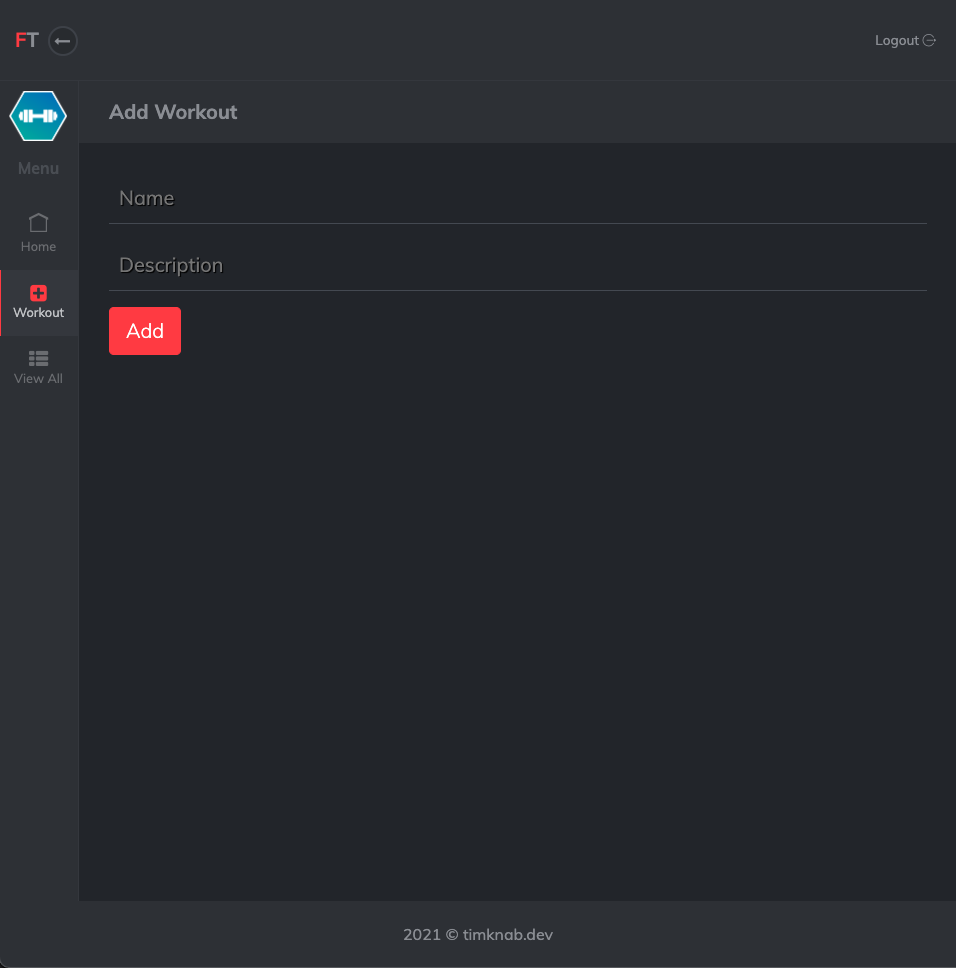
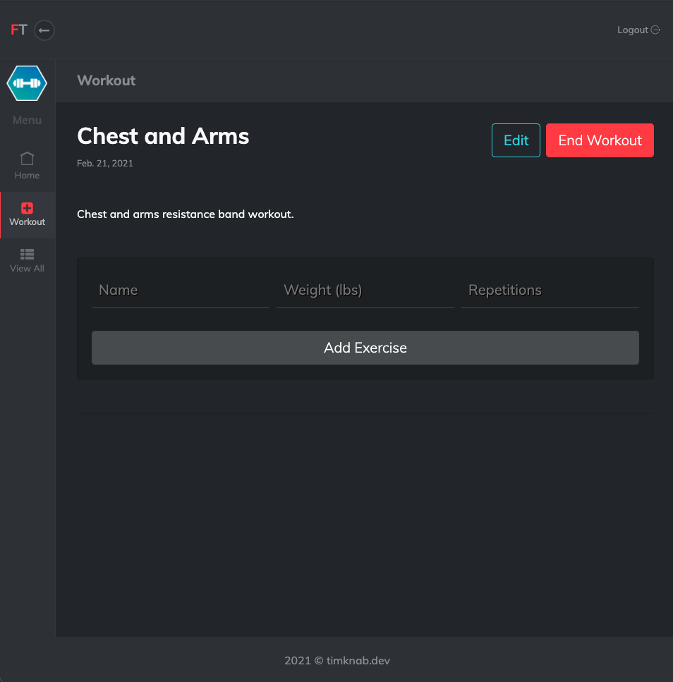
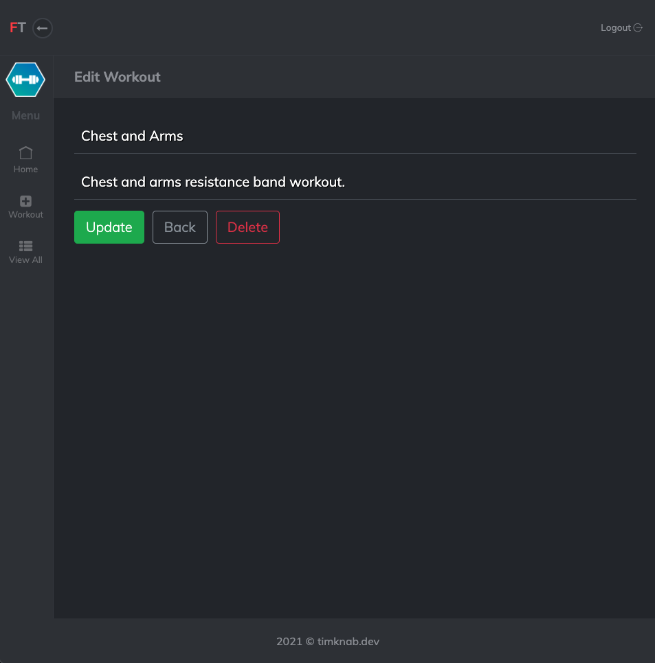
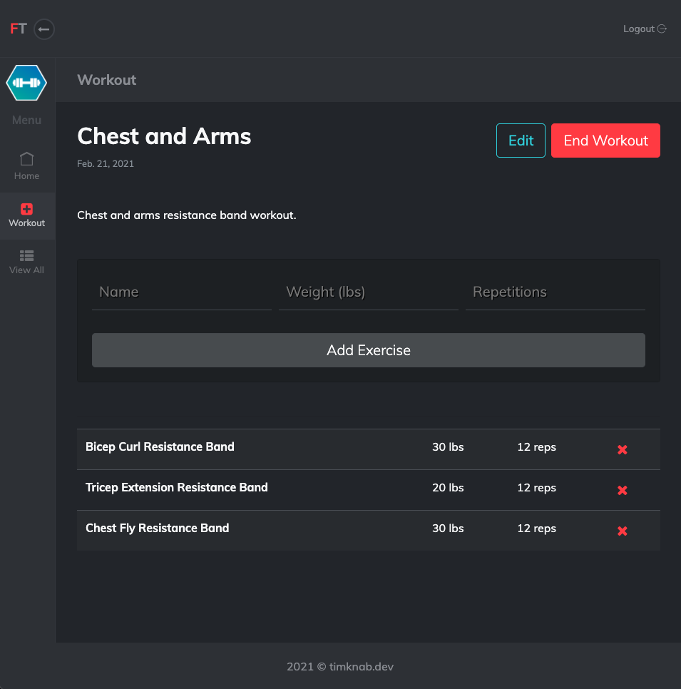
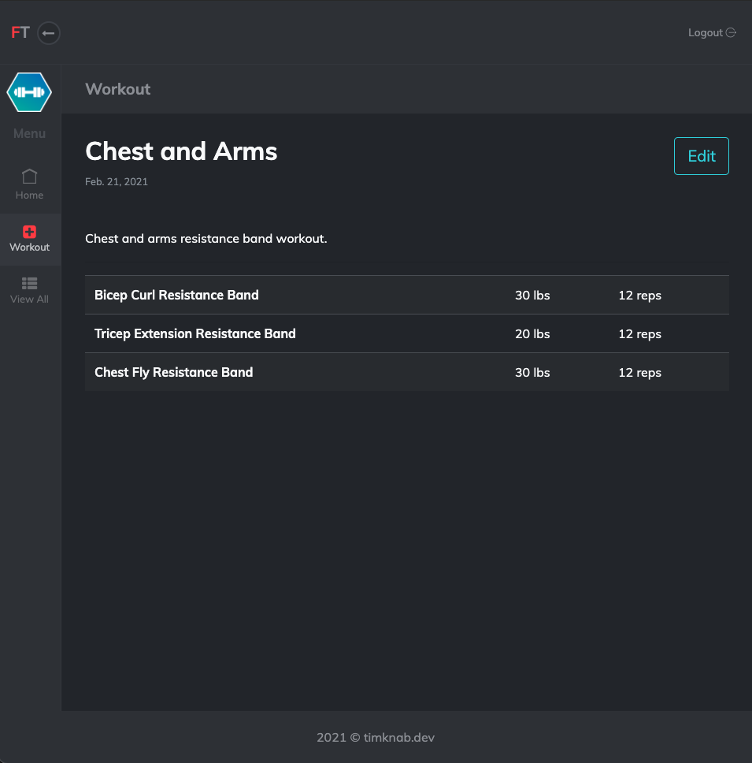
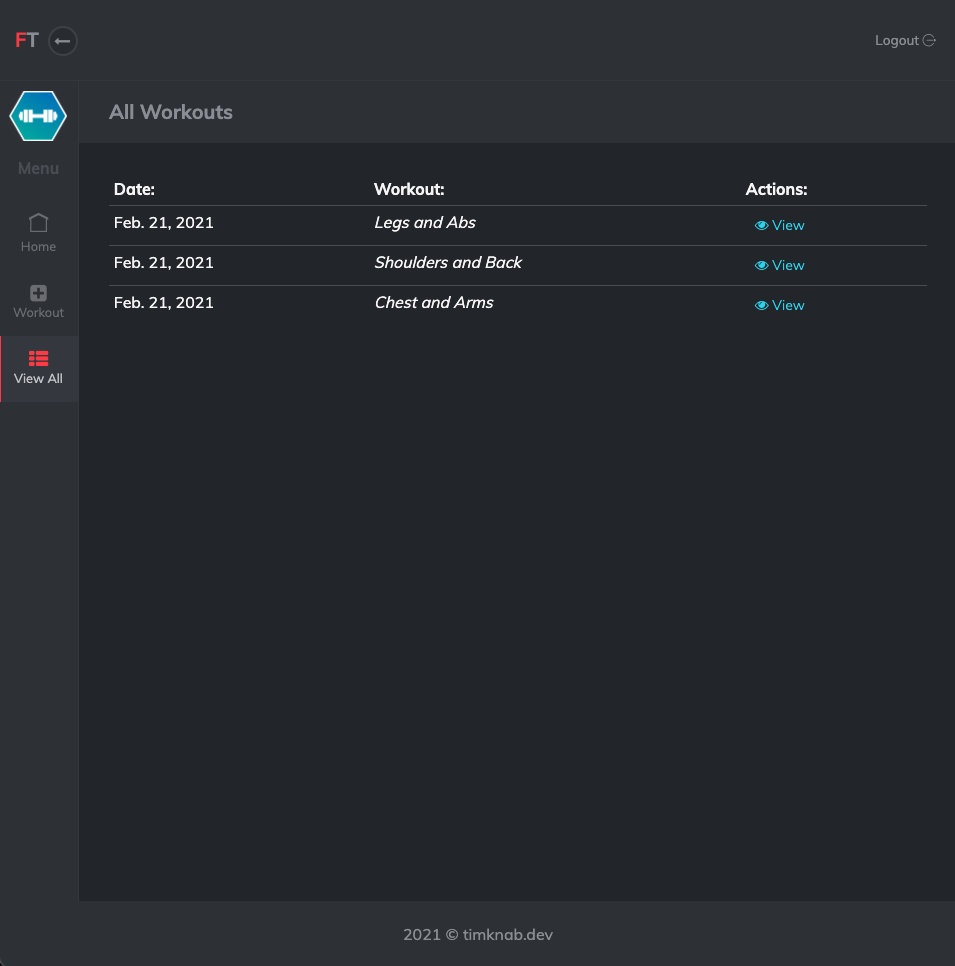
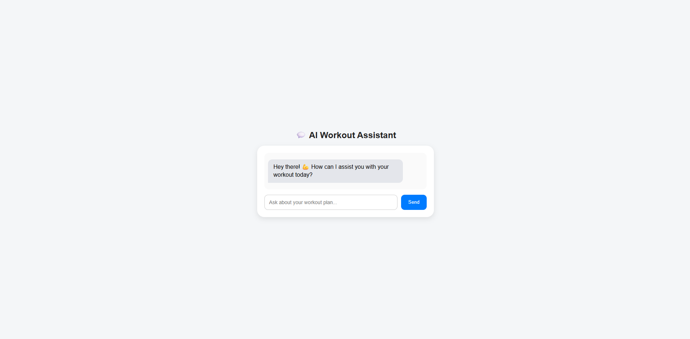

<p align="center">
  <h1 align="center">💪 FitnessTracker</h1>
  <p align="center">
    A modern, full-featured workout tracking web application with AI-powered assistance.
    <br />
    Built with Django &amp; Python · Dark Theme UI · AI Chatbot Integration
    <br />
    <br />
    <a href="#screenshots">View Screenshots</a>
    ·
    <a href="#features">Features</a>
    ·
    <a href="#getting-started">Get Started</a>
  </p>
</p>

---

## 📖 About

**FitnessTracker** is a full-stack web application that allows users to track their strength training workouts with a sleek, modern dark-themed interface. Users can register, log in, create and manage workouts, add exercises, and even get AI-powered workout recommendations through an integrated chatbot.

Built as a CRUD MVC RESTful application using Python and Django, FitnessTracker features an immersive dark UI with glassmorphism effects, smooth animations, and a premium user experience.

---

## 🛠️ Tech Stack

| Layer        | Technology                          |
|-------------|--------------------------------------|
| **Backend**  | Python 3, Django 4.2                |
| **Frontend** | HTML5, CSS3, JavaScript             |
| **Database** | SQLite3                              |
| **AI**       | Google Gemini API (Chatbot)         |
| **Auth**     | Bcrypt (Password Hashing)           |
| **Admin**    | Django Jazzmin                       |
| **Styling**  | Custom Dark Theme CSS               |

---

## ✨ Features

### 🔐 Authentication
- User registration with email, username & password
- Secure login/logout with bcrypt password hashing
- Terms of service agreement

### 🏋️ Workout Management
- **Create** new workouts with name and description
- **Add exercises** to workouts (name, weight, repetitions)
- **Edit** workout details
- **Delete** workouts and individual exercises
- **Complete** workouts and view summaries
- **View all** past logged workouts in a table

### 👤 User Profile
- Update username and email
- Upload and change profile picture
- Manage personal account settings

### 🤖 AI Workout Assistant
- Integrated chatbot powered by **Google Gemini API**
- Get personalized workout recommendations
- Ask questions about exercises, form, and routines

### 🎨 Premium Dark Theme UI
- Immersive dark mode with glassmorphism effects
- Responsive sidebar navigation
- Smooth micro-animations and transitions
- Modern typography and color palette

---

## 📸 Screenshots

### Login Page
<p align="center">
  
</p>

### Registration Page
<p align="center">
  
</p>

### Dashboard
<p align="center">
  
</p>

### Add Workout
<p align="center">
  
</p>

### Workout View (Empty)
<p align="center">
  
</p>

### Edit Workout
<p align="center">
  
</p>

### Workout with Exercises
<p align="center">
  
</p>

### Completed Workout Summary
<p align="center">
  
</p>

### All Workouts
<p align="center">
  
</p>

### AI Workout Chatbot
<p align="center">
  
</p>

---

## 🚀 Getting Started

### Prerequisites

- **Python 3.8+** installed on your system
- **pip** (Python package manager)
- A **Google Gemini API key** (for the AI chatbot feature)

### Installation

1. **Clone the repository**
   ```bash
   git clone https://github.com/the1percen/myminiproject.git
   cd myminiproject
   ```

2. **Create a virtual environment** (recommended)
   ```bash
   python -m venv venv
   source venv/bin/activate        # Linux/Mac
   venv\Scripts\activate           # Windows
   ```

3. **Install dependencies**
   ```bash
   cd workout_tracker
   pip install -r requirements.txt
   ```

4. **Set up environment variables**

   Create a `.env` file inside the `workout_tracker/` directory:
   ```env
   GEMINI_API_KEY=your_google_gemini_api_key_here
   ```

5. **Run migrations**
   ```bash
   python manage.py migrate
   ```

6. **Start the development server**
   ```bash
   python manage.py runserver
   ```

7. **Open your browser** and navigate to:
   ```
   http://127.0.0.1:8000/
   ```

---

## 📁 Project Structure

```
myminiproject/
├── Docimage/                    # Screenshots for documentation
├── workout_tracker/
│   ├── apps/
│   │   └── workout/
│   │       ├── models.py        # Data models (User, Workout, Exercise)
│   │       ├── views.py         # Business logic & API endpoints
│   │       ├── urls.py          # URL routing
│   │       ├── static/          # CSS, JS, images
│   │       │   └── workout/
│   │       │       └── css/
│   │       │           └── theme.css
│   │       └── templates/       # HTML templates
│   │           └── workout/
│   │               ├── index.html
│   │               ├── register.html
│   │               ├── dashboard.html
│   │               ├── add_workout.html
│   │               ├── workout.html
│   │               ├── edit_workout.html
│   │               ├── all_workouts.html
│   │               ├── chatbot.html
│   │               └── profile.html
│   ├── workout_tracker/
│   │   ├── settings.py          # Django settings
│   │   └── urls.py              # Root URL config
│   ├── manage.py
│   └── requirements.txt
├── .gitignore
└── README.md
```

---

## 📝 License

This project is open source and available for educational purposes.

---

<p align="center">
  Made with ❤️ using Django &amp; Python
</p>
